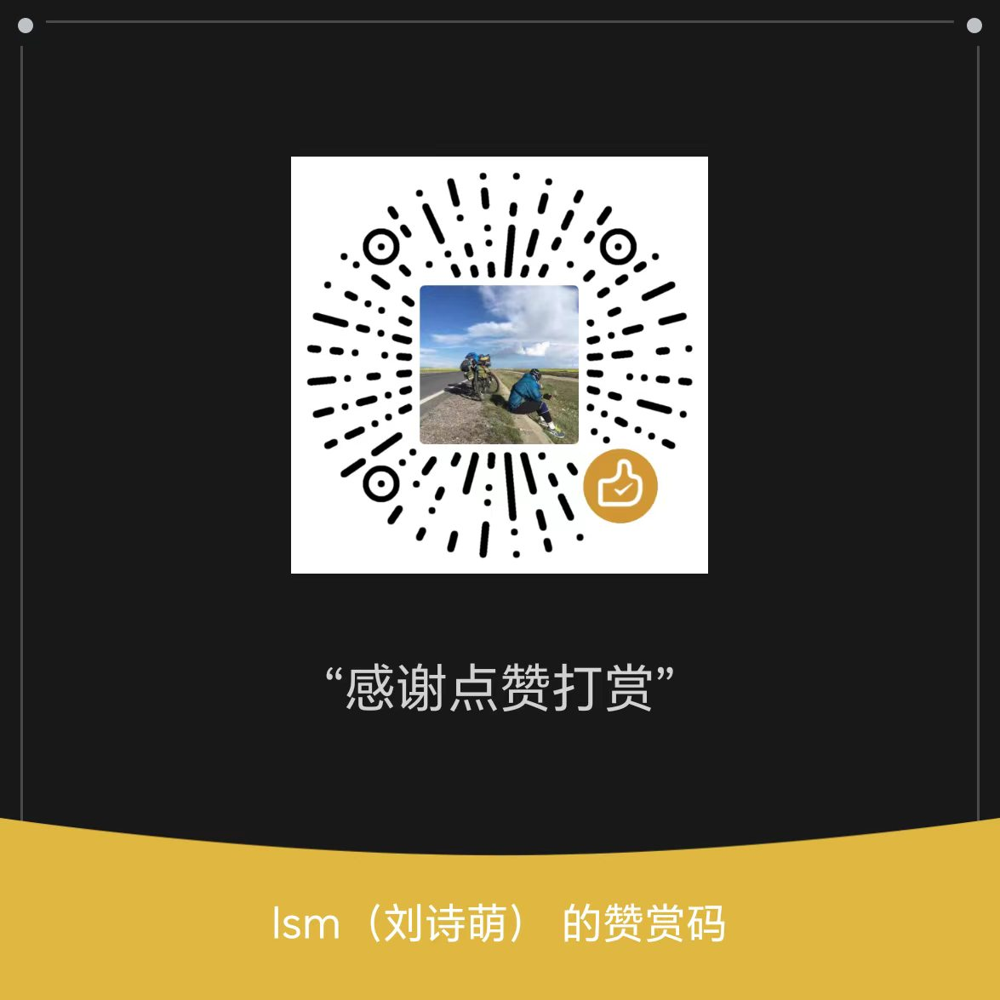

<!-- markdownlint-disable -->
<div align="center">

[🇨🇳 中文](README.md) · [🇬🇧 English](README.en.md) · [🇯🇵 日本語](README.ja.md)

---

```
╔═════════════════════════════════════════════════════════════════════╗
║  _     _                        _____           _                   ║
║ | |   (_)_ __   ___  ___  _   |_   _|__   ___ | |   _   _  ___     ║
║ | |   | | '_ \ / _ \/ __|| | | || |/ _ \ / _ \| |  | | | |/ _ \    ║
║ | |___| | | | |  __/\__ \| |_| || | (_) | (_) | |__| |_| |  __/    ║
║ |_____|_|_| |_|\___||___/ \__, ||_| \___/ \___/|_____\__, |\___|    ║
║                           |___/                      |___/         ║
║      AI Tokens Proxy · Load Balancing · Anthropic ⇄ OpenAI          ║
╚═════════════════════════════════════════════════════════════════════╝
```

## 🔀 Open-Source AI Tokens Proxy · N-Model Load Balancing · Agent-Session-Preserving

</div>
<!-- markdownlint-restore -->

<div align="center">

[](LICENSE)
[](CONTRIBUTING.md)
[](CLAUDE.md)
[](ServerGo)
[](ClientWeb)
[](README.md) [](README.en.md) [](README.ja.md)

</div>

---

> **🤖 100% AI-Agent-coded** — not a single line hand-written by a human.
> The entire project (Go backend, React frontend, protocol conversion layer, scheduling
> algorithms, crawler MCP, CI scripts) was written, tested, refactored and deployed
> autonomously by AI Agents. This repo is a full demonstration of "agent coding" on a
> **production-grade infrastructure project**.

> *One endpoint, N upstream model providers behind it.*
> *An Agent session stays sticky to one upstream for its whole task lifetime — load balancing never shreds it.*
> *The same proxy speaks both Anthropic and OpenAI protocols.*
> *If an upstream dies or runs out of balance (402), requests retry on another upstream — invisible to the agent above.*

---

## ✨ Key Features

- **🔀 N-model load balancing without splitting Agent sessions**: a single agent task easily spans hundreds of consecutive LLM calls. The session-recognition layer parses `session_id` from the request body and pins each session to one upstream, spreading load across providers safely.
- **🎛️ Four scheduling strategies**: `Pinned` / `Stable` / `Economic` implemented, `Smart` planned (see table below).
- **🔁 Automatic failover**: account-level upstream errors such as 402 (out of balance) trigger in-request retry on a different upstream — zero impact on the calling agent.
- **🔄 Bidirectional Anthropic ⇄ OpenAI protocol conversion**: full request/response conversion plus SSE streaming; Claude Code and OpenAI-style clients connect directly, upstream protocols can be freely mixed.
- **🖥️ Manager/User web dual-build isolation**: one codebase, two artifacts (`dist-manager` / `dist-user`); Rollup dead-code elimination guarantees zero admin code in the user artifact; separate manager and user JWT tracks.
- **🔒 Production-grade security**: bcrypt password hashing, centralized JWT secrets, blanket auth middleware on admin APIs, phone-number masking, `crypto/rand` key generation, trusted-proxy whitelist.
- **🕷️ Crawler CDP + MCP interface**: Chrome DevTools Protocol-driven web collection exposed to agents via MCP (port 29002).
- **📊 Real-time analytics**: token usage, latency/model distributions, agent tool-call reports over date ranges, streamed over WebSocket.

---

## 🎛️ Scheduling Strategies

| Strategy | Behavior | Best for |
|----------|----------|----------|
| **📌 Pinned** (implemented) | Always use the first configured upstream; no auto switch | A designated primary upstream |
| **🛡️ Stable** (implemented) | Use the head of the list; after 3 consecutive failures rotate it to the tail (order persisted) | Clear primary/backup setups |
| **💰 Economic** (implemented) | Deterministic FNV-1a session-hash stickiness + livePool consumption; reshuffled on restart; 402 triggers in-request upstream switch | Balancing quota packages / cost control |
| **🧠 Smart** (planned) | Multi-dimensional scoring on success rate, latency, price | Fully automatic optimal scheduling |

> Each AI route configures its own strategy and upstream list, effective immediately without restart.

---

## 🚀 Quick Start

### Prerequisites

- Go 1.22+, Node.js 18+, MySQL / MariaDB, Linux

### Install & Deploy

```bash
# 1. Clone
git clone <your-repo-url> LsmTokensServer
cd LsmTokensServer

# 2. Runtime config — auto-generated on first start (gitignored; contains secrets)
#    Template: cp LsmTokensServer.conf.example LsmTokensServer.conf
#    Set MySQL password, jwtSecret, managerUserName/managerPassword, upstream API keys

# 3. Frontend dependencies
cd ClientWeb && npm install && cd ..

# 4. Build frontend (dual build) + backend and start
./rebuild_restart_app.sh

# 5. Open in browser
# Manager Web  http://127.0.0.1:9101
# User Web     http://127.0.0.1:29001
```

### Ports

| Service | Port |
|---------|------|
| Manager Web (REST + admin SPA) | `9101` |
| AI proxy (HTTP) | `29000` |
| User Web (user SPA) | `29001` |
| MCP | `29002` |
| AI proxy (HTTPS) | `29003` |
| Crawler CDP | `9222` |

### Client example

```bash
# Claude Code / Anthropic-protocol clients
export ANTHROPIC_BASE_URL=http://127.0.0.1:29000
export ANTHROPIC_AUTH_TOKEN=<your-proxy-api-key>

# OpenAI-protocol clients
export OPENAI_BASE_URL=http://127.0.0.1:29000/v1
export OPENAI_API_KEY=<your-proxy-api-key>
```

---

## ⚙️ Tech Stack

| Module | Choice |
|--------|--------|
| 🚪 Backend | Go (module `github.com/lishimeng/LsmTokensServer`), Gin, GORM + MySQL/MariaDB, gorilla/websocket, JWT (HS256), bcrypt, in-house log rotation |
| 🪟 Frontend | React 18 + TypeScript, Vite (`__APP_ROLE__` build-time role constant, dual artifacts) |
| 📡 Proxy protocol | Anthropic Messages ⇄ OpenAI Chat Completions bidirectional conversion + SSE |
| 🧠 Scheduling | Session recognition + Pinned/Stable/Economic selectors (`ServerGo/models/agent_algorithm*.go`) |

---

## 📁 Project Layout

```
ServerGo/                       Backend core (domain-packaged)
├── config/       config loading
├── logger/       log rotation
├── database/     DB foundation
├── models/       business models + scheduling algorithms
├── recognizer/   agent/session/tool recognition
├── protocol/     Anthropic⇄OpenAI conversion + SSE
├── proxy/        AI proxy forwarding + rate limiting
├── api/          REST APIs (user + manager)
├── spider/       crawler CDP + MCP interface
├── websocket/    WS push (streaming ChatTotal)
└── system/       system helpers
ClientWeb/                      Frontend (React + Vite, dist-manager / dist-user dual build)
docs/                           knowledge base, protocol analysis, dev guides
python-generate-image-tool/     [local private submodule, not in repo] AI image generation SDK
go-web-debug-tool/              [local private submodule, not in repo] Chrome CDP debugging
rebuild_restart_app.sh          one-shot build + deploy + restart
ProjectPic/                     project assets (donation QR codes, etc.)
```

> **Submodules**: `python-generate-image-tool/` and `go-web-debug-tool/` are not open-sourced
> (they contain API keys); the main project builds and runs without them.

---

## 🔒 Security Highlights

- No hardcoded secrets: JWT secret and manager credentials live only in the `security` section of `LsmTokensServer.conf`.
- All manager business APIs are protected by `ManagerAuthMiddleware`.
- User passwords stored as bcrypt hashes only; responses blank passwords and mask phone numbers.
- The frontend never persists API keys; chat history capped at 200 entries / 30 days in localStorage.

Full policy: [`docs/开发指南/SECURITY.md`](docs/开发指南/SECURITY.md).

---

## 🤖 Agent-Coded Engineering

Every line in this repo was written by AI Agents (Claude Code et al.):

- **Zero hand-coding**: no human wrote a single line of Go / TypeScript / CSS / SQL.
- **Self-testing & self-fixing**: agents run `go vet`, `go test ./...`, `npm run build` and fix what breaks.
- **Self-deploying**: `rebuild_restart_app.sh` was agent-written.
- **Continuous iteration**: rules and lessons accumulate in CLAUDE.md for later agents to load.

---

## 🤝 Follow & Support

Find me on:

| Platform | Account |
|----------|---------|
| Kuaishou | **封刀灌海** |
| Douyin | **封刀灌海** |
| Bilibili | **封刀灌海** |
| Xiaohongshu | **封刀灌海** |
| WeChat Channels | **封刀灌海** |

---

## ☕ Donate

Servers and LLM API calls cost real money. If this project helps you, consider a donation:

| WeChat | Alipay |
|:------:|:------:|
|  |  |

**Contact**:

- 📱 Phone: `13520647302`
- 💬 WeChat: `liushimeng109117198`

---

## 📜 License

Released under the **MIT License** — see [`LICENSE`](LICENSE).
All code is AI-Agent-written, human-reviewed before commit.

---

## 🌟 Star / Watch / Fork

If this project changes how you think about agent coding or AI tokens proxies:

- ⭐ **Star** this repo
- 👁️ **Watch** for updates (the `Smart` scheduler is on the roadmap)
- 🍴 **Fork** to build your own AI tokens relay

Hosted in parallel on GitHub / Gitee / GitCode — see links in [README.md](README.md).

> 💡 One ⭐ spreads this further than ten blog posts.

**No human wrote this code. It is the work of AI Agents coding around the clock.**

---

**Version**: v2.0.57  |  **Last updated**: 2026-08-25  |  **Build**: Agent-built
