<!-- markdownlint-disable -->
<div align="center">

[🇨🇳 中文](README.md) · [🇬🇧 English](README.en.md) · [🇯🇵 日本語](README.ja.md)

---

```
╔═════════════════════════════════════════════════════════════════════╗
║  _     _                        _____           _                   ║
║ | |   (_)_ __   ___  ___  _   |_   _|__   ___ | |   _   _  ___     ║
║ | |___| | | | |  __/\__ \| |_| || | (_) | (_) | |__| |_| |  __/    ║
║ |_____|_|_| |_|\___||___/ \__, ||_| \___/ \___/|_____\__, |\___|    ║
║                           |___/                      |___/         ║
║      AI Tokens Proxy · Load Balancing · Anthropic ⇄ OpenAI          ║
╚═════════════════════════════════════════════════════════════════════╝
```

## 🔀 オープンソース AI Tokens 中継サービス · N モデル負荷分散 · Agent セッション保持型

</div>
<!-- markdownlint-restore -->

<div align="center">

[](LICENSE)
[](CONTRIBUTING.md)
[](CLAUDE.md)
[](ServerGo)
[](ClientWeb)
[](README.md) [](README.en.md) [](README.ja.md)

</div>

---

> **🤖 100% AI エージェントによる自動プログラミング** —— 人間が手書きしたコードは一行もありません。
> バックエンド Go、フロントエンド React、プロトコル変換レイヤー、スケジューリングアルゴリズム、
> クローラー MCP、CI スクリプトまで、すべて AI エージェントが自律的に設計・テスト・リファクタ・
> デプロイしました。**本番級インフラプロジェクト**における「エージェントプログラミング」の
> 完全なデモです。

> *1 つのエンドポイント、その裏に N 個のモデル上流。*
> *Agent のセッションはタスク全体を通じて同じ上流に固定され、負荷分散で切断されることはありません。*
> *同じプロキシが Anthropic と OpenAI 両方のプロトコルを話します。*
> *上流がダウンしたり残高不足（402）になったりすると、リクエストは自動的に別の上流で再試行します。*

---

## ✨ 主な特徴

- **🔀 Agent セッションを分割しない N モデル負荷分散**：セッション識別レイヤーがリクエストボディから `session_id` を解析し、同一セッションを同じ上流に固定したまま複数上流へ負荷を分散。
- **🎛️ 4 種類のスケジューリング方式**：`指定型` / `安定型` / `経済型` 実装済み、`スマート型` は計画中（下表参照）。
- **🔁 自動フェイルオーバー**：402（残高不足）など上流のアカウント級エラーでリクエスト内再試行・上流切り替え。呼び出し側の Agent は無感知。
- **🔄 Anthropic ⇄ OpenAI 双方向プロトコル変換**：リクエスト／レスポンスの完全相互変換 + SSE ストリーミング。Claude Code・OpenAI 系クライアントが直接接続可能。
- **🖥️ 管理者／ユーザー Web のデュアルビルド分離**：1 つのソースから 2 つの成果物（`dist-manager` / `dist-user`）。Rollup のデッドコード除去によりユーザー側成果物に管理コードは混入しません。
- **🔒 本番級セキュリティ**：bcrypt パスワードハッシュ、JWT シークレット一元管理、管理 API 全件をミドルウェアで保護、電話番号マスキング、`crypto/rand` によるキー生成。
- **🕷️ クローラー CDP + MCP インターフェース**：Chrome DevTools Protocol による収集機能を MCP（ポート 29002）で Agent に提供。
- **📊 リアルタイム統計**：トークン使用量・レイテンシ分布・モデル分布・Agent ツール呼び出しの期間レポートを WebSocket でストリーミング。

---

## 🎛️ 4 種類のスケジューリング方式

| 方式 | 挙動 | 適用场景 |
|------|------|---------|
| **📌 指定型**（実装済み） | 常に設定された第 1 上流を使用。自動切替なし | 主上流を明示指定 |
| **🛡️ 安定型**（実装済み） | 先頭の上流を使用。連続 3 回失敗で先頭を末尾へローテーション（順序は永続化） | 主従構成・切替最少 |
| **💰 経済型**（実装済み） | FNV-1a セッションハッシュによる粘着割当 + livePool 消費方式。再起動で再シャッフル。402 でリクエスト内切替 | 複数パッケージの均等利用・コスト制御 |
| **🧠 スマート型**（計画中） | 成功率・レイテンシ・価格などの多軸スコアリングで最適上流を選択 | 全自動最適スケジューリング |

> AI ルートごとに方式と上流リストを個別設定でき、再起動なしで即時反映。

---

## 🚀 クイックスタート

### 前提

- Go 1.22+、Node.js 18+、MySQL / MariaDB、Linux

### インストールとデプロイ

```bash
# 1. クローン
git clone <your-repo-url> LsmTokensServer
cd LsmTokensServer

# 2. 実行時設定 —— 初回起動時に LsmTokensServer.conf を自動生成（機密情報のため gitignore 済み）
#    テンプレート: cp LsmTokensServer.conf.example LsmTokensServer.conf
#    MySQL パスワード、jwtSecret、管理者資格情報、上流 API キーを設定

# 3. フロントエンド依存のインストール
cd ClientWeb && npm install && cd ..

# 4. フロント（デュアルビルド）+ バックエンドを一括ビルドして起動
./rebuild_restart_app.sh

# 5. ブラウザでアクセス
# 管理者 Web  http://127.0.0.1:9101
# ユーザー Web http://127.0.0.1:29001
```

### 🚀 初回起動セットアップ

v2.0.74 から **初回起動ゼロコンフィグ** 対応：

1. `./rebuild_restart_app.sh` を実行するだけでサービス起動。
2. **`LsmTokensServer.conf` の手動コピー (`cp .conf.example`) は不要** —— ファイルがなければ自動生成されます。
3. 起動ログと stdout に `[FIRST-RUN]` サマリーブロックが出力されます（以下の情報を含む）：
   - 自動生成された `managerUserName`（例：`adm-7kq3m9xp`）
   - 自動生成された `managerPassword`（base62 16 桁）
   - 自動生成された `jwtSecret`（base64 32 バイト）
4. ブラウザで `http://127.0.0.1:9101/ManagerLogin` を開き、上記の認証情報でログイン。
5. **ログイン後、すぐにデフォルトパスワードを変更してください。**

> ⚠️ パスワードは**今回起動の stdout に 1 回だけ**表示されます。`*.example` ファイルには絶対に書き込まれず、git にも入りません。紛失した場合は `LsmTokensServer.conf` の `security.managerUserName/managerPassword` を編集して再起動してください。

### 🔒 スーパー管理者の自動無効化

MySQL に**すでに業務ユーザーが存在**する場合（`TAgentHttpUserInfo` の `deleted_at IS NULL` 行数が 1 以上）、サービスは自動的に：

- `security.managerUserName` / `managerPassword` を `disable` に書き換え；
- `managerWebAuthDisabled = true` をセット；
- すべての管理業務 API（`/UserManageInterface`、`/AIRouteInterface` など）を拒否；
- `/ManagerLogin` 自体は到達可能ですが、ログイン要求は「管理端超級管理者が無効化されました」のメッセージで拒否されます。

これは**一方向の操作**で、ユーザーテーブルを空にしても自動復元されません。再有効化するには `LsmTokensServer.conf` の `managerUserName/managerPassword` を `disable` 以外の値に書き戻してサービスを再起動してください。

### ❓ よくある質問（FAQ）

| 質問 | 回答 |
|---|---|
| **スーパー管理者のパスワードが見つからない** | 起動 stdout の `[FIRST-RUN]` ブロックに表示されます。紛失した場合は `LsmTokensServer.conf` の `security.managerPassword` を編集して再起動。 |
| **管理画面に「無効化されました」と表示される** | データベースにすでに業務ユーザーがいるため自動無効化された状態です。再有効化するには conf の `managerUserName/managerPassword` を `disable` 以外の値に書き換えて再起動。 |
| **MySQL の認証情報をカスタマイズしたい** | `LsmTokensServer.conf` の `DBMysql.User/Pwd` を編集して再起動。`validateAndFixConfig` が自動検証します。 |

### ポート構成

| サービス | ポート |
|---------|------|
| 管理者 Web（REST + 管理 SPA） | `9101` |
| AI プロキシ（HTTP） | `29000` |
| ユーザー Web（ユーザー SPA） | `29001` |
| MCP | `29002` |
| AI プロキシ（HTTPS） | `29003` |
| クローラー CDP | `9222` |

### クライアント接続例

```bash
# Claude Code / Anthropic プロトコル系クライアント
export ANTHROPIC_BASE_URL=http://127.0.0.1:29000
export ANTHROPIC_AUTH_TOKEN=<プロキシ API キー>

# OpenAI プロトコル系クライアント
export OPENAI_BASE_URL=http://127.0.0.1:29000/v1
export OPENAI_API_KEY=<プロキシ API キー>
```

---

## ⚙️ 技術スタック

| モジュール | 選定 |
|------|------|
| 🚪 バックエンド | Go（`github.com/lishimeng/LsmTokensServer`）、Gin、GORM + MySQL/MariaDB、gorilla/websocket、JWT (HS256)、bcrypt、自作ログローテーション |
| 🪟 フロントエンド | React 18 + TypeScript、Vite（ビルド時ロール定数 `__APP_ROLE__`、デュアル成果物） |
| 📡 プロキシプロトコル | Anthropic Messages ⇄ OpenAI Chat Completions 双方向変換 + SSE |
| 🧠 スケジューリング | セッション識別 + 指定型/安定型/経済型セレクター（`ServerGo/models/agent_algorithm*.go`） |

---

## 📸 機能スクリーンショット

> 以下のスクリーンショットはすべて本番稼働中の実環境から取得しています。パスワード・API キー・完全な電話番号はマスク済み（`135****7302`、`sk-xxxx****`）。  
> 全ページは `go-web-debug-tool`（Chrome DevTools Protocol 自動化ツール）で手動操作なしに自動収集。

### 管理者 Web（スーパー管理者ビュー）

| ログイン画面 | ユーザー管理 |
|:------:|:--------:|
| 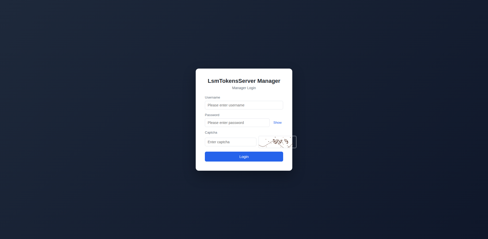 | 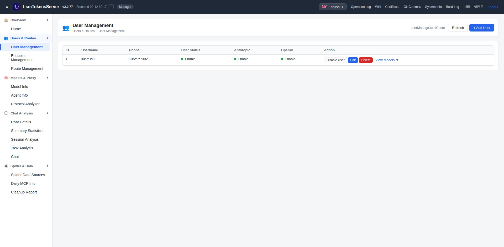 |

| スマートルート管理（上部） | スマートルート管理（23 ルート全件） |
|:--------:|:----------:|
| 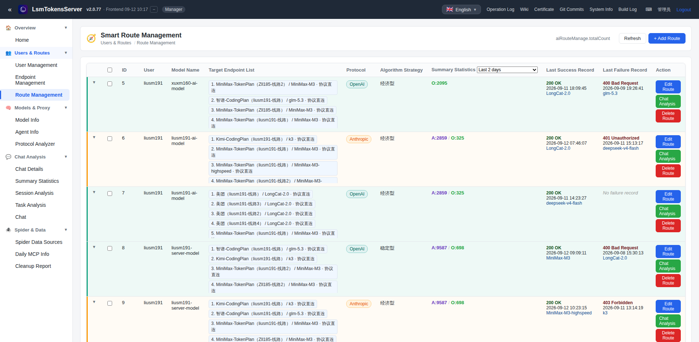 | 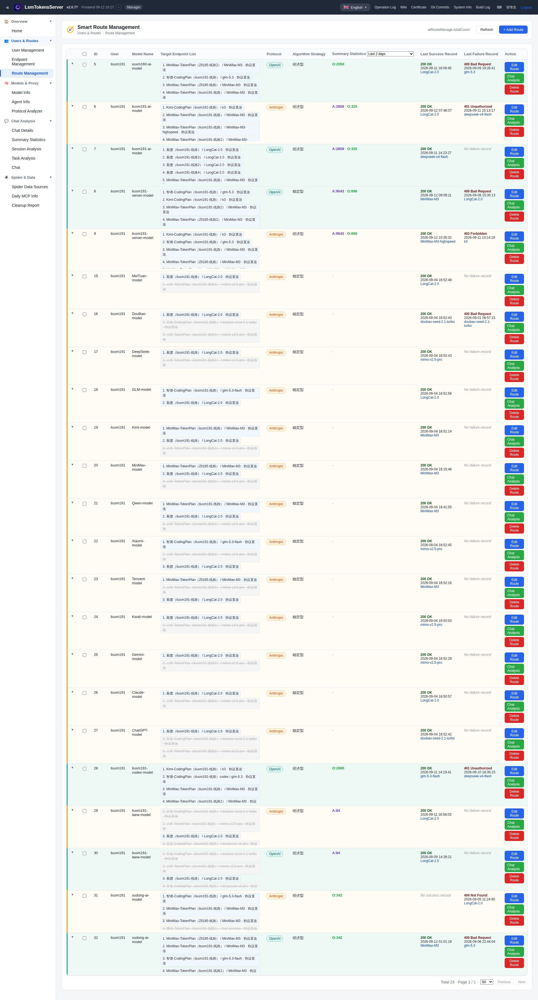 |

| モデル統計 | Agent 統計 |
|:--------:|:----------:|
| 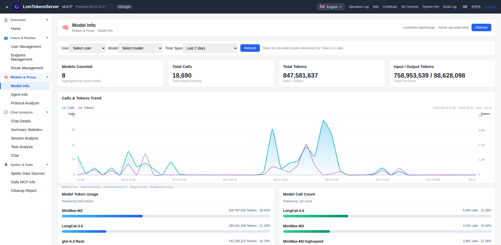 | 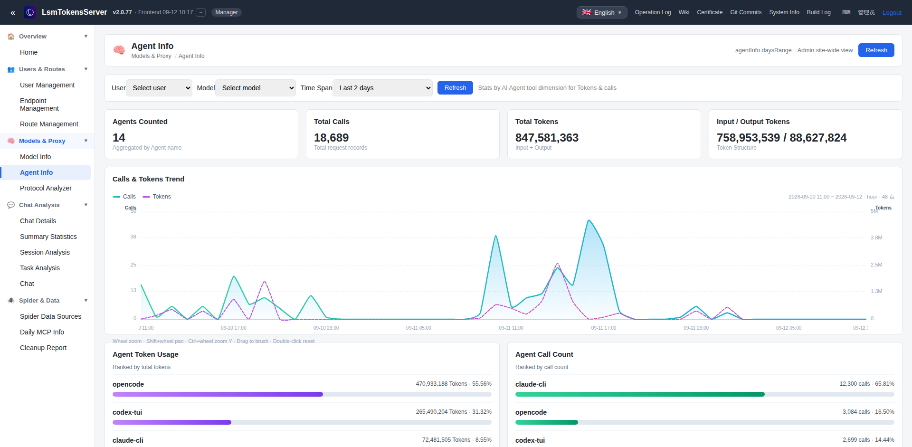 |

| モデル統計（推移 + ランキング） | Agent 統計（推移 + ランキング） |
|:--------:|:----------:|
| 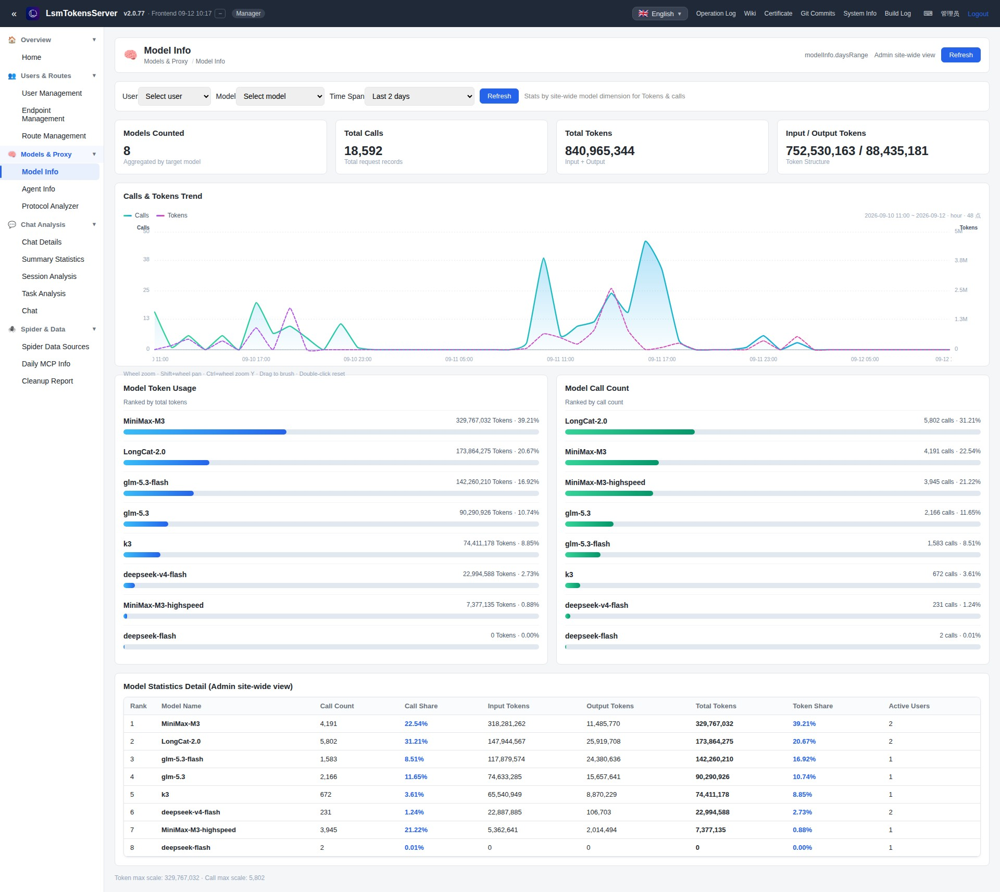 | 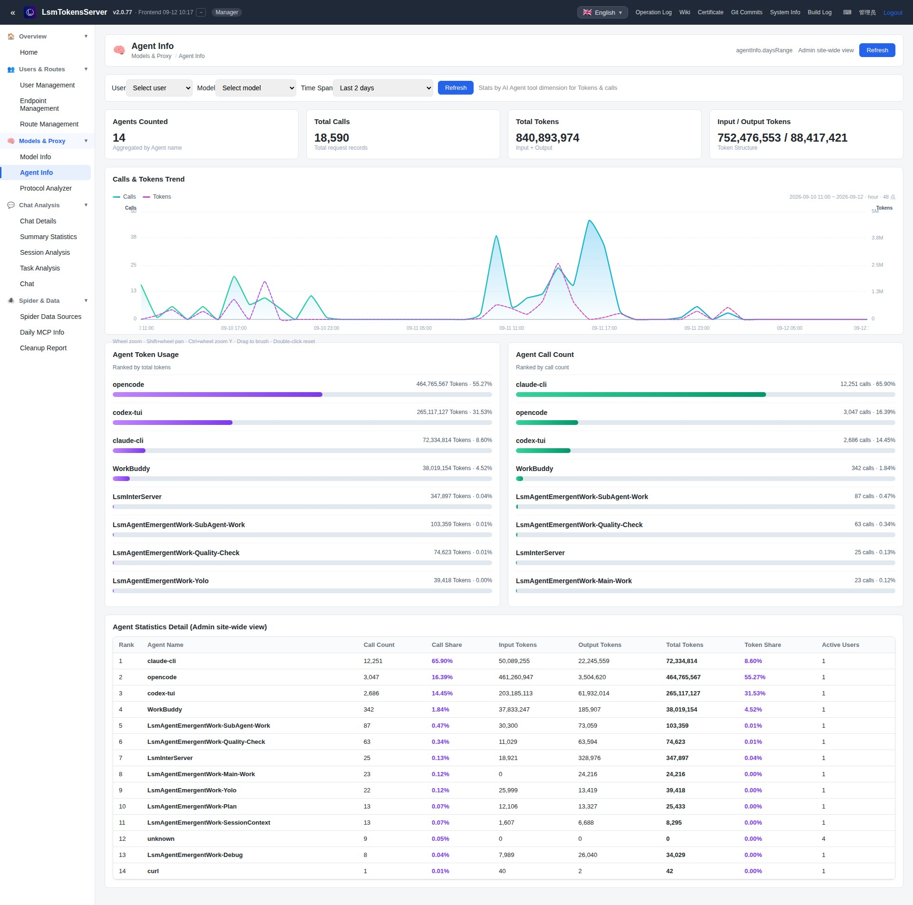 |

| スパイダーデータソース | クリーンアップレポート |
|:--------:|:----------:|
| 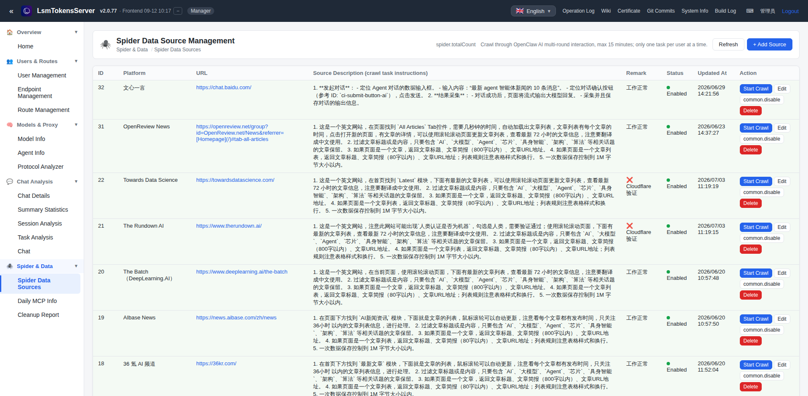 | 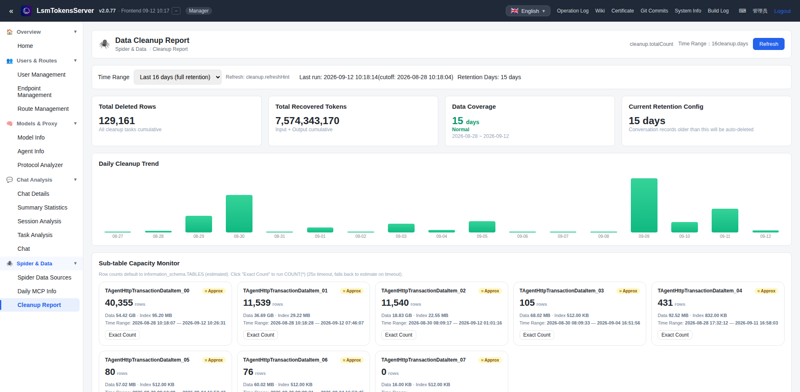 |

| クリーンアップレポート（推移 + サブテーブル容量） | チャット詳細（行展開） |
|:--------:|:----------:|
| 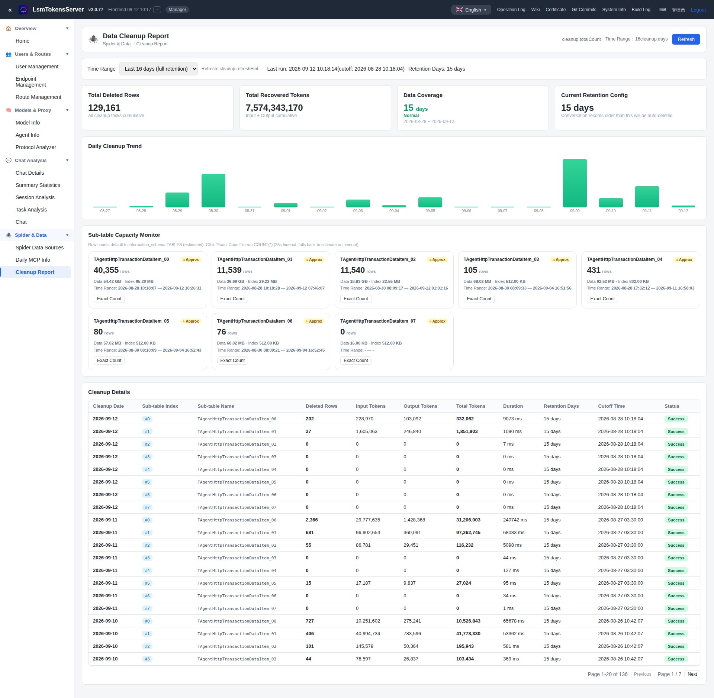 | 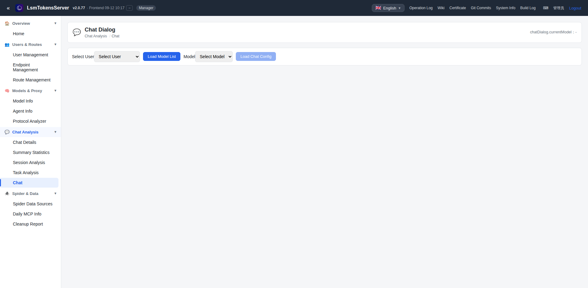 |

### ユーザー Web（業務ユーザー視点）

| ユーザーログイン（Model / User 両タブ） | ユーザーホーム（21 モデルカード） |
|:--------:|:----------:|
| 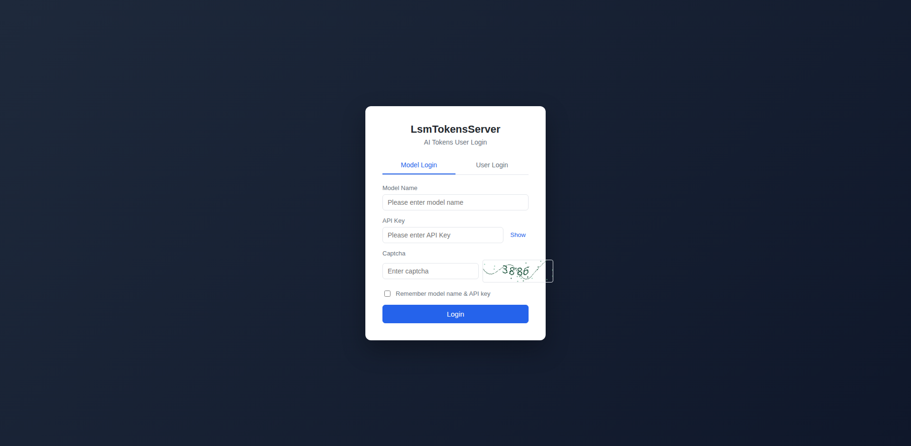 | 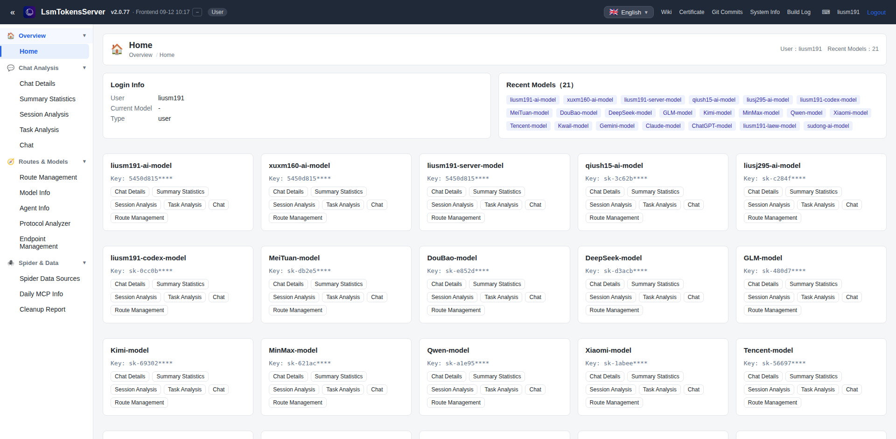 |

| チャット画面（System Prompt + API 設定） |
|:--------:|
| 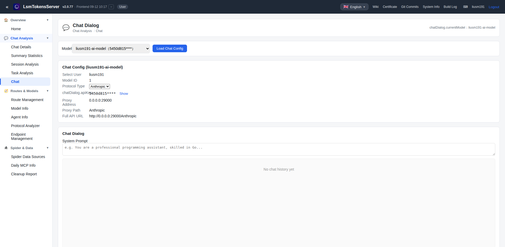 |

---

## 📖 管理者 Web 利用ガイド

### Step 1 · ログイン（スーパー管理者 / 業務ユーザー）

```text
1. ブラウザで http://127.0.0.1:9101/ManagerLogin にアクセス
2. ユーザー名 + パスワード + 画像認証コードを入力
3. 「Login」をクリック
4. 初回ログイン後は必ずデフォルトパスワードを変更（v2.0.74 以降、初回起動時にランダムパスワードが stdout に出力）
```


> **セキュリティ**：スーパー管理者の認証情報は `LsmTokensServer.conf → security.managerUserName/managerPassword` のみに保持し、データベースには保存しません。  
> ユーザーパスワードは `bcrypt` ハッシュのみで保存。API レスポンスのパスワードは空にし、電話番号は `api.MaskPhone` でマスクします。

### Step 2 · ユーザー管理（CRUD + 有効化 / 無効化）

```text
1. 左メニュー → Users & Routes → User Management
2. 「+ Add User」で業務ユーザーを作成（名前 / パスワード / 電話 / Anthropic / OpenAI 有効化フラグ）
3. 行内「Disable / Edit / Delete / View Models」
4. 「Refresh」でリスト更新
```


### Step 3 · AI ルート設定（プロトコル / アルゴリズム / 上流）

```text
1. 左メニュー → Route Management
2. 「+ Add Route」：プロトコル（Anthropic / OpenAI）→ アルゴリズム（指定型 / 安定型 / 経済型）→ 上流追加
3. 「Edit Route」で上流の順序・API Key・ステータスを編集
4. 「Chat Analysis」で該当ルートの会話詳細へ
```

対応するスケジューリングアルゴリズム：

| 方式 | 適用场景 |
|------|---------|
| 📌 **指定型** | 主従が明確、特定の上流を強制使用 |
| 🛡️ **安定型** | 連続 3 回失敗で先頭を末尾へローテーション |
| 💰 **経済型** | 複数パッケージを均等化（セッションハッシュ粘着） |
| 🧠 **スマート型**（計画中） | 成功率 / レイテンシ / 価格による多軸スコアリング |


### Step 4 · 監視 / 分析（Model · Agent · クリーンアップ）

```text
1. 左メニュー → Models & Proxy → Model Info / Agent Info
2. 上部フィルタ：ユーザー、モデル、時間範囲
3. 推移チャートはホイール / Shift+ホイール / ドラッグ brush / ダブルクリックリセット対応
4. 下部に「トークン使用量ランキング」「呼び出し回数ランキング」と占有率バー
```

| Model Info | Agent Info |
|:----------:|:----------:|
|  |  |

> 🧹 **データ保持方針**：デフォルトで 15 日間保持。Cleanup Report 画面で過去の削除量・回収トークン量・サブテーブル容量を監視できます。

---

## 🚀 ユーザー Web 利用ガイド

### Step 1 · ログイン（2 通り）

```text
1. ブラウザで https://127.0.0.1:29001/ にアクセス
2. Model Login タブ：モデル名 + API Key + 認証コード
   User  Login タブ：ユーザー名 + パスワード + 電話 + 認証コード
3. 「Login」クリックでホームへ遷移
```


### Step 2 · ホーム：モデルカード

```text
1. 上部に現在のユーザー / 現在のモデル / モデル総数を表示
2. 各モデルカードにマスク済み API Key（先頭 8 文字）+ 6 つのショートカット
   - Chat Details / Summary Statistics / Session Analysis / Task Analysis / Chat / Route Management
3. 「Chat」をクリックして会話画面へ
```


### Step 3 · 対話を開始

```text
1. モデルカードの「Chat」をクリック → ChatDialog ページへ
2. 上部に Model / Protocol / API Key / Proxy URL（マスク済み）が表示
3. System Prompt と User Message を編集し「Send」をクリック
4. モデル応答をストリーミングで受信
```


---

## 📁 プロジェクト構成

```
ServerGo/                       バックエンド核心（ドメイン別パッケージ）
├── config/       設定読み込み
├── logger/       ログローテーション
├── database/     DB 基盤
├── models/       業務モデル + スケジューリングアルゴリズム
├── recognizer/   agent/session/tool 識別
├── protocol/     Anthropic⇄OpenAI 変換 + SSE
├── proxy/        AI プロキシ転送 + レート制限
├── api/          REST API（ユーザー + 管理者）
├── spider/       クローラー CDP + MCP
├── websocket/    WS プッシュ（ChatTotal ストリーミング）
└── system/       システム補助
ClientWeb/                      フロントエンド（dist-manager / dist-user デュアルビルド）
docs/                           ナレッジベース・プロトコル分析・開発ガイド
python-generate-image-tool/     [ローカル非公開サブモジュール] AI 画像生成 SDK
go-web-debug-tool/              [ローカル非公開サブモジュール] Chrome CDP デバッグ
rebuild_restart_app.sh          ワンショット ビルド + デプロイ + 再起動
ProjectPic/                     プロジェクトアセット（QR コードなど）
```

> **サブモジュールについて**：`python-generate-image-tool/` と `go-web-debug-tool/` は
> API キー等を含むため非公開です。取得しなくても本体はビルド・実行可能です。

---

## 🔒 セキュリティ設計概要

- ハードコードされたシークレット禁止：JWT シークレットと管理者資格情報は `LsmTokensServer.conf` の `security` セクションのみ。
- 管理者の全業務 API は `ManagerAuthMiddleware` で保護。
- ユーザーパスワードは bcrypt ハッシュのみ保存。レスポンスではパスワードを空にし電話番号をマスキング。
- フロントエンドは API キーを永続化しない。チャット履歴は localStorage で 200 件 / 30 日上限。

---

## 🤝 フォローと支援

| プラットフォーム | アカウント |
|------|---------|
| 快手（Kuaishou） | **封刀灌海** |
| 抖音（Douyin） | **封刀灌海** |
| Bilibili | **封刀灌海** |
| 小红书（RED） | **封刀灌海** |
| WeChat チャンネル | **封刀灌海** |

---

## ☕ 支援（投げ銭）

サーバーと LLM API の呼び出しには継続的なコストがかかります。このプロジェクトが役に立ったら、ぜひご支援ください：

| WeChat | Alipay |
|:------:|:------:|
|  |  |

**連絡先**:

- 📱 電話：`13520647302`
- 💬 WeChat：`liushimeng109117198`

---

## 📜 ライセンス

**MIT License** で公開 —— 詳細は [`LICENSE`](LICENSE)。
すべてのコードは AI エージェントが作成し、人間がレビューの上コミットしています。

---

## 🌟 Star / Watch / Fork

このプロジェクトが「エージェントプログラミング」や「AI Tokens 中継」に関する認識を変えたなら：

- ⭐ **Star** — より多くの人に届けるために
- 👁️ **Watch** — 今後の更新をフォロー（`スマート型` スケジューラーは開発ロードマップに）
- 🍴 **Fork** — あなた専用の AI Tokens 中継サービスを構築

> 💡 ⭐ 1 個は、ブログ 10 本よりも多くの人に届きます。

**これは人間が書いたコードではありません。AI エージェントたちが日夜プログラミングした作品です。**

---

**バージョン**：v2.0.57  |  **最終更新**：2026-08-25  |  **ビルド**：Agent 自動ビルド
